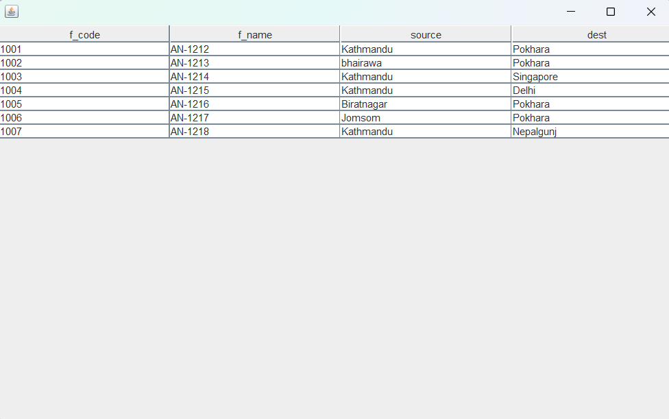
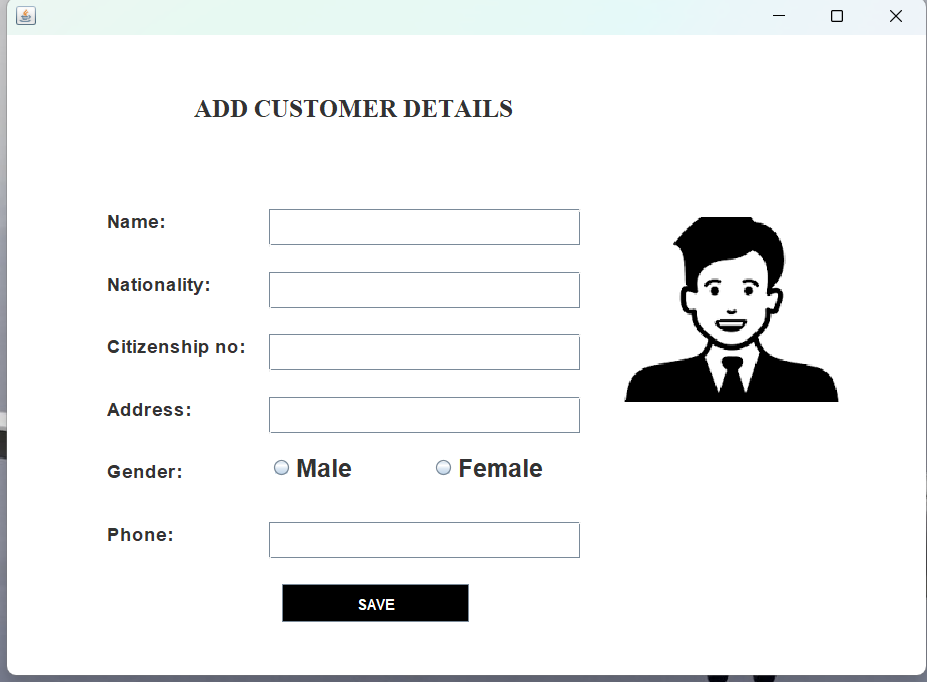
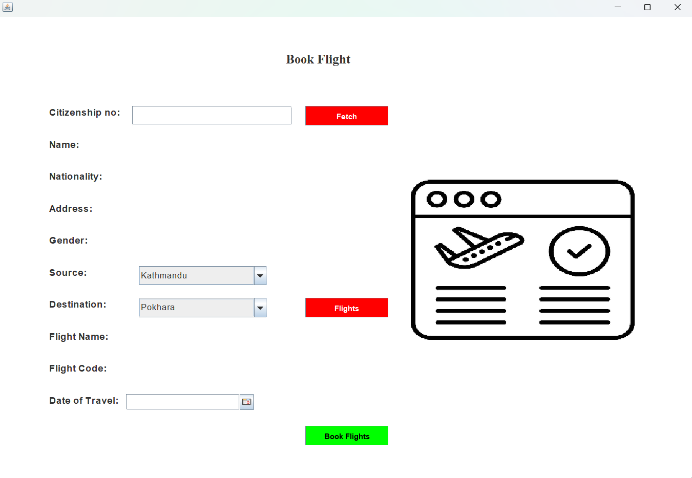
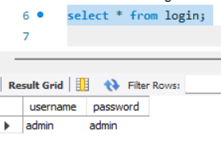
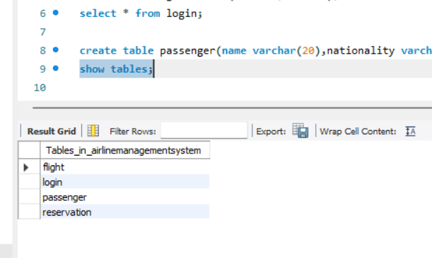
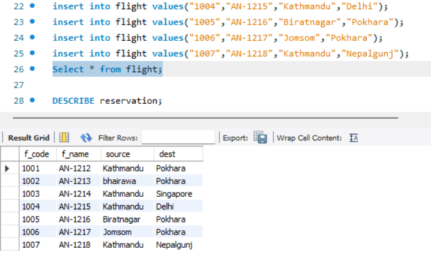
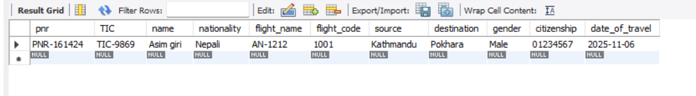

# Airline Ticket Management System 

## Introduction

The Airline Management System is a software designed to manage airline operations efficiently. It handles flight scheduling, ticket booking, cancellations, customer support, and staff management while providing real-time flight updates to improve accuracy and convenience.

## Concept Used

Java & OOP: For system logic using classes and objects.

Swing: To create the graphical user interface (GUI).

MySQL & JDBC: For database storage and connectivity.

Event Handling: To manage user actions like clicks.

Exception Handling: To handle runtime errors smoothly.

Modular Design: For separating booking, flight, and staff modules.

## UI
#### 1.Homepage Page

#### 2. Page

#### 3.details

#### 3.info

#### 4. datefix

## SQL and Databases

#### 1.login table

#### 2. Tables

#### 3.flight

#### 4. reservation

### Conclusion
The development of the Airline Management System in Java has successfully provided a robust, user-friendly, and efficient solution for automating airline operations. By utilizing Java Swing for the frontend and MySQL for the backend, the system allows for seamless passenger registration, flight scheduling, and ticket booking. 

