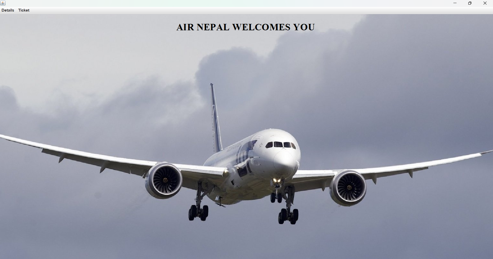
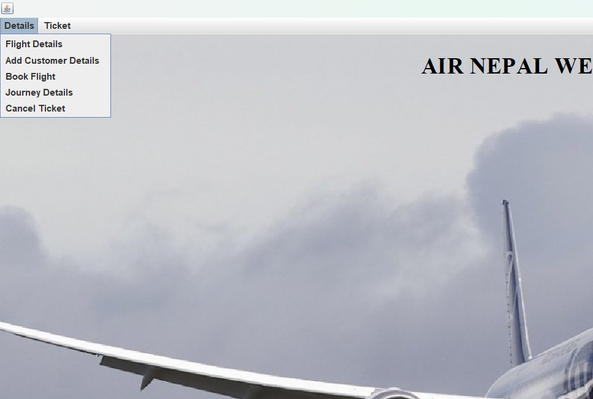

# Airline Ticket Management System 

## Introduction

The Airline Management System is a software designed to manage airline operations efficiently. It handles flight scheduling, ticket booking, cancellations, customer support, and staff management while providing real-time flight updates to improve accuracy and convenience.

## Concept Used

Java & OOP: For system logic using classes and objects.

Swing: To create the graphical user interface (GUI).

MySQL & JDBC: For database storage and connectivity.

Event Handling: To manage user actions like clicks.

Exception Handling: To handle runtime errors smoothly.

Modular Design: For separating booking, flight, and staff modules.

## UI
#### 1.Homepage Page

#### 2. Page

